# Edit Cobol files with Visual Studio Code.

## Paragraph suggestion and documentation
This extension suggests paragraphs based on what is typed on _perform_ clause. Notice that it also parses a **java-like** documentation for paragraphs, as follows.

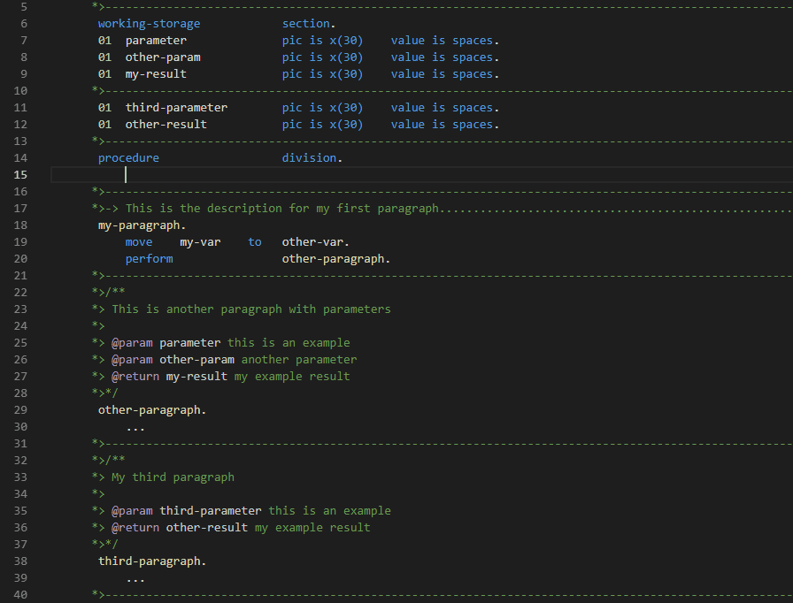

## Code highlight
When mouse is over some Cobol keywords, the **related keywords** are **highlighted** for better **understanding**.

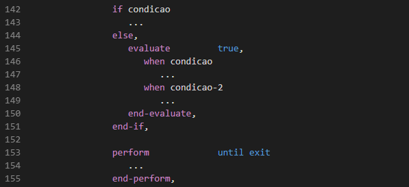

## Peek definition
You can also peek Cobol **variable** and **paragraph** definitions!

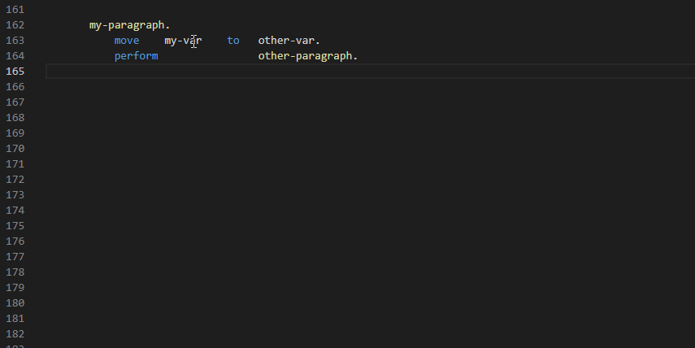

## Formatter and loop completion
The Language Server provides automatic formatting for several Cobol clauses as shown below:

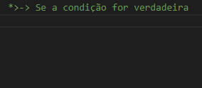

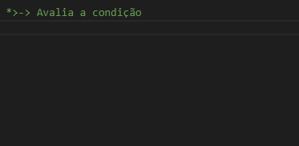

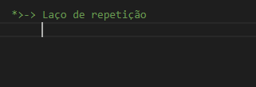

## IntelliSense for variable declaration
The variable declaration is done in two steps so that the extension parses the picture and generates the most approprivate VALUE in the VALUE clause:

* If it's a numeric display variable (picture contains **.**, **z**, **b**, **-** or **,**) inserts **VALUE IS ZEROS**.

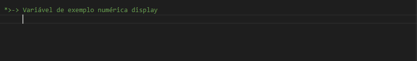

* If it's a numeric variable for computing, with decimal **v** or negative **s**, inserts **VALUE IS ZEROS COMP**.

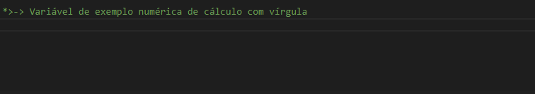

* If it's an alphanumeric variable inserts **VALUE IS SPACES**.

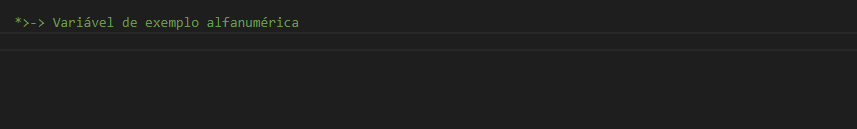

* If it's a  variable for computing, without decimal **v** nor negative **s**, inserts **VALUE IS ZEROS COMP-X**.

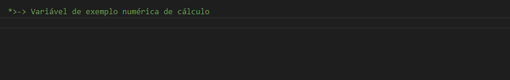

## Snippets
This extension provides by default **several snippets** related to Cobol functions/commands to make typing easier and faster.
Besides, user can add **personal snippets** and even *filter the filename* with a RegEx, making them **only appear** to specific **groups of files**.

First of all, configure the directory where specific JSON snippets are located:

    "rech.editor.cobol.snippetsRepositories": [
        "F:\\MySnippets"
    ]

Second, create one or more JSON files following the example below. This example adds two snippets for files with name containing **WREG**.
```json  
{
    "conditions": {
        "sourceFileNameRegex": ".*WREG.*"
    },
    "snippets": [
        {
            "prefix": "My first snippet",
            "body": "This will appear in editor when snippet is selected",
            "description": "Description of my snippet"
        },
        {
            "prefix": "My second snippet",
            "body": "This is the body of my second snippet with ${0:placeholder}",
            "description": "Description of second snippet"
        }
   ]
}
```

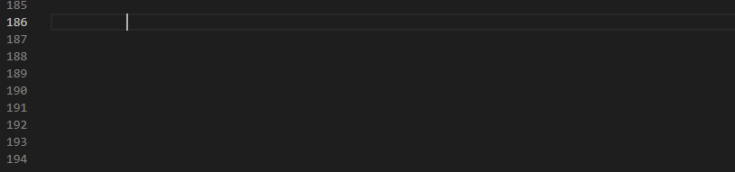

Snippet **placeholders** are also **supported**.
