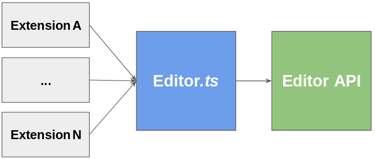

# rech-editor-vscode

## Overview
This package provides an implementation of Editor.ts class to hide VSCode specific APIs, hence preventing extensions developed by Rech Informática from dealing with complex types and other subroutines attached to this programming editor.

In theory, it is possible to change the programming editor by just creating another implementation of Editor.ts class, since only and only this class interacts with the editor API.

It can be considered a middleware layer.

## IntelliSense for Cobol variable declaration
The variable declaration is done in two steps so that the editor parses the picture and generates the most approprivate VALUE in the VALUE clause:

* If it's a numeric display variable (picture contains **.**, **z**, **b**, **-** or **,**) inserts **VALUE IS ZEROS**.

* If it's a numeric variable for computing, with decimal **v** or negative **s**, inserts **VALUE IS ZEROS COMP**.

* If it's an alphanumeric variable inserts **VALUE IS SPACES**.

* If it's a  variable for computing, without decimal **v** nor negative **s**, inserts **VALUE IS ZEROS COMP-X**.

